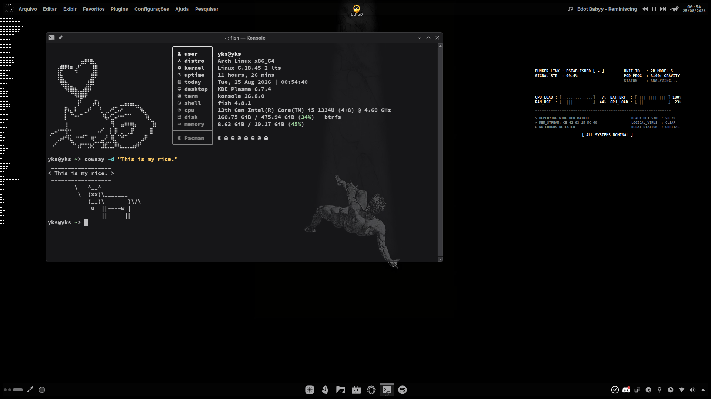

# YKS Monochrome Rice

The simplest rice, yet the slickest one. A minimalist, monochrome KDE Plasma setup for Arch Linux.

[▶ Watch the rice video](assets/midias-rice/video-rice.mp4)

## Information

- **Operating System:** Arch Linux
- **Desktop Environment:** KDE Plasma
- **Terminal:** Konsole (monochrome)
- **Fetch:** fastfetch
- **Panel:** panel-colorizer (Black preset)
- **Background:** Available in `wallpapers/`

## KDE Rice

### Theming

The following are applied through KDE System Settings:

- **Global Theme:** Breeze (with Monochrome color scheme)
- **Colors:** Monochrome
- **Application Style:** Fusion
- **Plasma Style:** Monochrome
- **Window Decoration:** Monochrome
- **Icons:** Yet Another Monochrome Icon Set (YAMIS)
- **Cursor:** Bibata Modern Ice
- **SDDM:** silent — config at `assets/silent-conf/monochrome.conf`
- **GRUB:** grubsouls

### Components

- **SDDM:** silent (monochrome.conf)
- **GRUB:** grubsouls
- **Terminal:** Konsole (monochrome)
- **Fetch:** fastfetch
- **Panel:** panel-colorizer

### Panels

**Top panel:**
- panel-colorizer (load conditions: maximized window → Black; normal → Translucent or Transparent)
- Kurve
- Global Menu
- MC-Clock
- Plasmusic Toolbar
- CatWalkR
- Default KDE Digital Clock

**Bottom panel:**
- Plasma Gnome Pager
- Color Picker
- Fancy Task NG
- System Tray

### Wallpapers

All wallpapers are stored in the `wallpapers/` folder of this repository:

- digital-gaze-monochrome.mp4
- fall.png
- nuvem-dark.png

### Widgets used

- Window Title
- Global Menu
- System Tray
- Better Inline Clock
- Window Buttons
- Panel Colorizer

---

# YKS Monochrome Rice (Português)

O rice mais simples, porém o mais elegante. Um setup minimalista e monocromático do KDE Plasma para Arch Linux.

[▶ Assista ao vídeo do rice](assets/midias-rice/video-rice.mp4)

## Informações

- **Sistema Operacional:** Arch Linux
- **Ambiente de Desktop:** KDE Plasma
- **Terminal:** Konsole (monochrome)
- **Fetch:** fastfetch
- **Painel:** panel-colorizer (preset Black)
- **Fundo de tela:** Disponível em `wallpapers/`

## KDE Rice

### Temas

Os seguintes itens são aplicados pelo Configurações do Sistema do KDE:

- **Tema Global:** Breeze (com esquema de cores Monochrome)
- **Cores:** Monochrome
- **Estilo de Aplicativos:** Fusion
- **Estilo do Plasma:** Monochrome
- **Decoração de Janelas:** Monochrome
- **Ícones:** Yet Another Monochrome Icon Set (YAMIS)
- **Cursor:** Bibata Modern Ice
- **SDDM:** silent com a config `assets/silent-conf/monochrome.conf`
- **GRUB:** grubsouls

### Componentes

- **SDDM:** silent (monochrome.conf)
- **GRUB:** grubsouls
- **Terminal:** Konsole (monochrome)
- **Fetch:** fastfetch
- **Painel:** panel-colorizer

### Painéis

**Painel superior:**
- panel-colorizer (Condições de carregamento: janela maximizada → Black; Normal → Translucent ou Transparente)
- Kurve
- Menu Global
- MC-Clock
- Plasmusic Toolbar
- CatWalkR
- Relógio Digital padrão do KDE

**Painel inferior:**
- Plasma Gnome Pager
- Seletor de cores
- Fancy Task NG
- Área de notificação

### Wallpapers

Todos os wallpapers estão na pasta `wallpapers/` deste repositório:

- digital-gaze-monochrome.mp4
- fall.png
- nuvem-dark.png

### Widgets utilizados

- Window Title
- Global Menu
- System Tray
- Better Inline Clock
- Window Buttons
- Panel Colorizer
